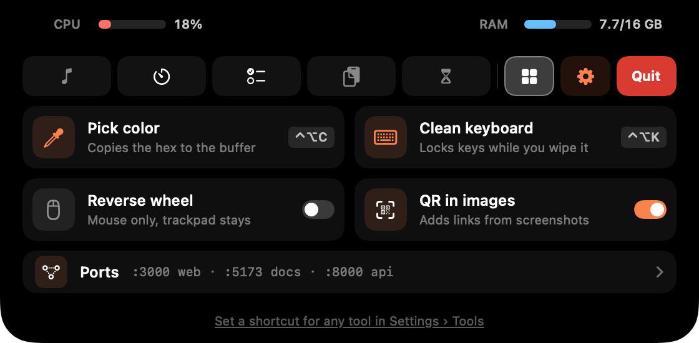
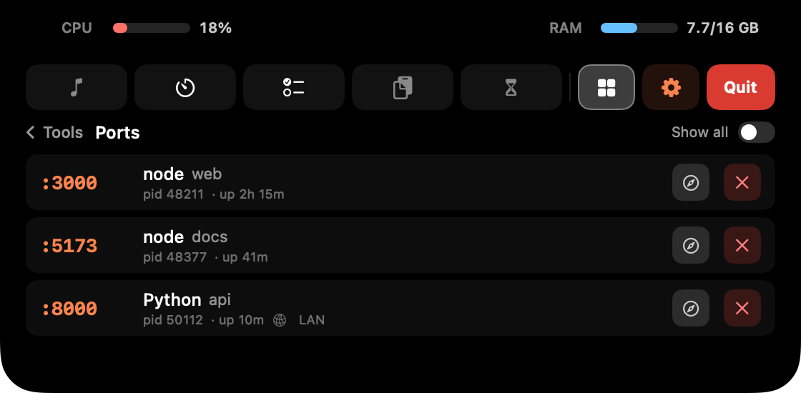
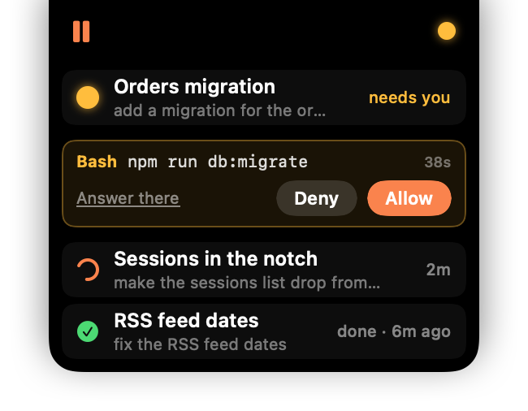

<p align="center">
  
</p>

<h1 align="center">Cape</h1>

<p align="center">
  A lightweight hub that lives right in your MacBook notch. Where Apple's Dynamic
  Island floats free, Cape is the <strong>peninsula</strong> — attached to the top
  edge, always in reach.<br/>
  Hover the notch and it expands; move away and it collapses. No Dock icon, no menu-bar icon.
</p>

<p align="center">
  <strong>English</strong> · <a href="README.ru.md">Русский</a>
</p>

<p align="center">
  <a href="https://github.com/timryadovouu/cape/actions/workflows/build.yml">
    
  </a>
  <a href="https://github.com/timryadovouu/cape/releases">
    
  </a>
  <a href="https://www.apple.com/macos/">
    
  </a>
  <a href="https://www.swift.org">
    
  </a>
  <a href="https://developer.apple.com/xcode/swiftui/">
    
  </a>
  <a href="https://github.com/argmaxinc/WhisperKit">
    
  </a>
  <a href="LICENSE">
    
  </a>
</p>

---

## Overview

**Cape** turns the empty space around the camera notch into a small control
center. Modules sit on the left of a horizontal icon rail; on the right are
**Tools**, the coral **Settings** gear and **Quit**. It's a single Swift Package
executable — SwiftUI + AppKit, with a single dependency
([WhisperKit](https://github.com/argmaxinc/WhisperKit)) powering on-device voice
dictation — and it **updates itself** from GitHub Releases.

- Runs as an **accessory app** (`LSUIElement`) — invisible in the Dock and menu bar.
- Sits over the physical notch and morphs like the iPhone Dynamic Island.
- Pinned to the built-in (notch) screen, so plugging in a TV or an extended
  display doesn't move it; works on notchless Macs too (a synthetic top-center notch).

## Screenshots

<p align="center">
  
  
</p>
<p align="center">
  
  
</p>
<p align="center">
  
  
</p>

## Modules

| Module | What it does |
| --- | --- |
| ⏱ **Timer** | Pomodoro with focus presets (5 / 10 / 15 / 25 / 30 / 60 min), a long break every 4 sessions. Configurable break lengths and a completion sound — pick any system sound (▶ to preview) and choose whether it still plays during a Focus. A live countdown shows to the right of the notch; each phase change slides a **Focus / Break** alert in from the left. **Hover the collapsed countdown for inline pause / next / cancel** (or click the time to pause) — no need to open the panel. |
| 📋 **Buffer** | A persistent clipboard. Everything you copy is saved as a **real file** under the buffer folder, in a per-day `YYYY-MM-DD` subfolder — text, images, and any copied files. The list is grouped under **Pinned / Today / Yesterday / date** headers, with the copy time on every entry. Click an entry to copy it back, or **drag it straight out** to Finder / any app. Per-row **star / copy / delete** on hover — **starred items pin to the top and survive** retention, "Clear day", and end-of-day wipes. "Finder" opens the folder, "Clear day" wipes today. A **mic** button dictates speech straight into the buffer (see *Voice dictation*). **Copy an image with a QR code** — a screenshot to the clipboard (⌃⇧⌘4), say — and each code's link is added as its own entry right under it (can be turned off). |
| 🎵 **Media** | Now playing for **Spotify** (AppleScript) and **cmus** (`cmus-remote`): **cover art**, title and artist, and a coral **progress bar** — click or drag to seek; click the right-hand time to switch between *time left* and *track length*. Covers come from Spotify, or for cmus from a `cover` / `folder` / `front` / `album` `.jpg`/`.png` in the album folder (or art embedded in MP3/M4A files). It also finds covers of albums ripped as one file with a cue sheet and of tracks in `Disc 1` / `CD2` folders. **Media keys (F7 / F8 / F9) work for cmus too** — Cape forwards them, and the track shows up in Control Center. |
| ✅ **Tasks** | A local to-do list with **reminders**. Write the time right into the task — *"позвонить маме в 15:00"*, *"через 20 минут"*, *"завтра в 9"*, *"call mom at 3pm"* (24-hour clock) — or click the 🔔 on any task to open its **card**: edit the text, pick a quick time (in 1 h, 18:00, tomorrow 9:00, Monday 9:00) or a date on the calendar and a 24-hour time. Enter saves, Esc closes. When it's due, a **ringing bell** slides out to the right of the notch with a sound; hover it to jump to Tasks. With reminders around, tasks are grouped into **Overdue / Today / Upcoming / No date / Done**. Copy, delete, and a trash that keeps deleted tasks for a while. |
| ⏳ **Screen Time** | Local, on-device usage tracking: it credits the frontmost app every second and shows ranked apps (with icons), total time and switch count — **how many apps to list is up to you** (top 5–20 or all). A **ring splits the day by category** — Work, Browsing, Social, Entertainment, Learning, Other — sorted automatically (known apps, then the category an app declares); click a category to list only its apps, whose bars take its color. **Each day is kept as its own snapshot — browse past days with ◀ / ▶**, and toggle a bar chart of the current week (Mon–Sun). Resets at midnight; history retention is configurable. |

The **Tasks, Buffer and Screen Time** panels have a little home-indicator grabber
at the bottom — tap it to grow the panel vertically (and again to shrink).

## Tools

Utilities that aren't tabs, on the **▦ Tools** page at the right of the rail.
The one-shot ones can each get a **global shortcut** in Settings › Tools (any
combination with ⌘, ⌥ or ⌃ — no extra permission needed).

<p align="center">
  
</p>

- **Pick color** — the system magnifier loupe; click any pixel and its hex
  (`#FA834D`) is copied to the clipboard and the buffer, with a swatch flashing in
  the notch. Esc cancels.
- **Clean keyboard** — locks every key (media, volume and brightness keys
  included) behind a full-screen overlay so you can wipe the keyboard. The
  trackpad stays live for the **Done** button; it also unlocks by itself after
  2 minutes, on sleep, or when the screen locks.
- **Reverse wheel** (a switch) — flips a mouse wheel's scroll direction while the
  trackpad keeps natural scrolling, like Scroll Reverser (don't run both, or the
  wheel flips twice). A Magic Mouse counts as a trackpad here.
- **QR in images** (a switch) — links from QR codes in copied images go to the
  buffer (see *Buffer*).
- **Ports** — what's listening on this Mac's TCP ports: port, process, project
  folder, uptime, and **LAN** when it's reachable from your network. Open one in
  the browser or stop it (click ✕ twice); dev servers are shown, *Show all* adds
  system services. Read with `lsof`, only while the page is open.

## Beside the camera

When the panel is open, the black areas either side of the lens show live
**system metrics**: **CPU** on the left (coral bar + %), **RAM** on the right
(used / total GB). RAM "used" is resident active + wired memory, matching
`htop` / `btop` rather than Activity Monitor's higher, compression-inclusive
figure. No tab, no clutter — just there while you're already looking.

## The collapsed strip

Even when closed, the brow stays useful:

- **Left** — a pulsing **equalizer** while music plays (a coral ⏸ when paused);
  **click it to pause / play**, rest on it a moment to open straight to Media
  (can be turned off). Brief flashes also appear here: a coral clip on copy,
  **Focus / Break** on a timer phase change, the picked color, a QR link, a
  finished terminal command (✓ / ✗), a new Cape version, and — when you **plug in
  the charger** — a springing ⚡ with a battery filling up to the current percent.
- **Right** — a pulsing **coral blob** while a Claude Code session is working,
  **amber** when one waits for you — hover it for the sessions list (see below);
  the Pomodoro **countdown** while a timer runs (hover it for inline
  **pause / next / cancel**); and a **ringing bell** when a task reminder is due.

The music, copy and Claude islands are the same width, so the brow grows evenly
on both sides of the camera — and while the Claude list is open with nothing on
the left, an empty island mirrors Claude's, keeping it centered.

## Claude Code integration

Optional, off by default. Flip **Track Claude Code** in Settings and Cape
gives you:

<p align="center">
  
</p>

- A pulsing **coral blob** on the right of the notch while any Claude Code
  session is working — it lights only between your prompt and Claude's stop (and
  stays lit through long turns), so it's a real "thinking now" indicator. It turns
  **amber** when a session **waits for you**.
- **Hover the blob** and your sessions drop down from the brow — as wide as the
  brow itself: what each is doing (working · needs you · asks you · done), its
  title and your last prompt. **Click a session to jump into it** — in the Claude
  app, straight into that conversation; a terminal comes to the front. A finished
  session leaves the list once you open it, or by itself after 15 minutes. Slide
  left from the blob along the brow to open the full panel instead.
- **Allow / Deny from the notch.** When Claude asks to run a tool, the request
  shows up under its session (`Bash  npm run db:migrate`) with a countdown.
  Answer it there, or pick *Answer there* — unanswered, it goes back to the
  terminal / app after the timeout (*Settings › Claude*, 1 minute by default).
  Claude waits while the notch does. Questions and plan approvals aren't
  intercepted — they need the real dialog; the list just shows them.
- Once you start using your 5-hour window, a coral line in the Timer tab shows
  when it resets — **"Claude limits reset at HH:MM"** (or **"Claude will be ready
  at HH:MM"** when it's actually maxed out) — and **"Claude is ready!"** once it
  frees up. The reset time is read back from disk, so it survives quitting Claude.
- Optionally, a **sound when Claude finishes thinking** — any system sound, with
  toggles to stay quiet during Focus/DND or while the Claude app is in front.

Works wherever Claude Code runs: the terminal and the Claude app's Code tab.

**How it works.** Enabling the toggle merges a few [hooks](https://code.claude.com/docs/en/hooks)
and a `statusLine` command into `~/.claude/settings.json` (backed up to
`settings.json.bak` first; your other settings are preserved; Cape refreshes its
entries by itself if the app moves):

- The **hooks** append session events to `~/.claude/cape/events.jsonl` (with the
  app a session runs in); that stream drives the blob and the list.
- **Permission requests** go through a `PermissionRequest` hook that runs Cape
  itself (a hidden `permission` subcommand): it hands the request to the notch as
  a file in `~/.claude/cape/pending/` and waits for Allow / Deny. If Cape isn't
  running, or the feature is off, it steps aside at once and Claude asks as usual.
- To open a session in the Claude app, Cape reads (never writes) the app's own
  session records to find its id and title, and opens its `claude://` link.
- The **reset time** comes from whichever Claude you use:
  - **Terminal Claude Code** — Cape installs *itself* as your `statusLine`
    (a hidden `statusline` subcommand), the only place the CLI exposes
    when a window resets. Your terminal footer becomes a compact
    `Opus 4.8 · project · main · ctx 42% · 5h 63% · wk 21%`.
  - **Desktop app** — the chat never runs a statusLine, so Cape reads the
    reset time straight from the desktop app's own local storage instead
    (best-effort: it's undocumented and may change between Claude versions).

Everything stays local — nothing is sent anywhere.

## Terminal: `cape done`

Add `; cape done` to a long command and go do something else — when it ends, the
notch flashes **✓** (green) or **✗** (red) with the command and how long it took,
plus a sound (Glass / Basso, can be turned off):

```bash
npm run build; cape done
swift test; cape done
```

`cape` is a zsh function, so it sees the exit status of the command before it —
no `$?` needed — and zsh history suggestions pick the whole line up after the
first time. Use `;`, not `&&`, or a failure never reaches it.

**Long commands** (off by default): the same flash after *any* command that ran
longer than a threshold (30 s by default) — only while you're in another window,
and not for editors, `ssh`, `claude`, `less`, `top` and the like.

Install it from **Settings › Terminal** — it adds one line to `~/.zshrc` (backed
up to `~/.zshrc.cape-backup`); open a new terminal tab afterwards. The function
reports by dropping a small file into Cape's data folder, which Cape picks up at
once.

## Voice dictation

A **mic** button in the Buffer tab turns speech into text, fully **on-device** —
no audio leaves your Mac. Speak, and the transcript lands on the clipboard, ready
in the buffer.

- **Local Whisper** via [WhisperKit](https://github.com/argmaxinc/WhisperKit),
  running on the Neural Engine. Pick the model in Settings (Tiny → Large v3 Turbo
  — bigger is more accurate and uses more RAM); it's **downloaded once** and
  warmed at launch so the first dictation is instant.
- **Language & translation** — choose the spoken language (auto-detect can
  misread some, e.g. Russian, so pick it explicitly) and optionally translate to
  English.
- **"note …" → Tasks** — a transcript starting with *note* / *заметка* is filed
  as a task instead of going to the clipboard (and a time in it becomes a reminder).
- **Global keys** (need Accessibility permission), use any combination:
  - **Double-tap** to start / stop — **⌥ Option** (either side), **right ⌥** only,
    or **⌃ Control**.
  - **Hold to talk** like a walkie-talkie — hold **🌐 Fn** and/or **right ⌥**,
    release to transcribe. A quick press keeps its usual job (e.g. the emoji
    picker), and using the key in a chord (⌥+letter, Fn+⌫) cancels the recording.
- The mic button reflects its state — recording (pulsing), loading the model,
  transcribing — and stays disabled until a model is downloaded.

## Settings

The coral **gear** opens a resizable window with a sidebar of pages, like
System Settings (it remembers its size and the last page):

- **General** — Launch at login and Track Claude Code.
- **Updates** — current version, *Check for Updates*, *Install & Relaunch*, and automatic checks.
- **Notch** — the default tab, the reset-to-default-tab delay, *open Media when hovering the music island*, and the charging flash.
- **Tabs** — enable/disable and reorder the tabs in the rail.
- **Timer** — short/long break lengths, the end-of-session sound, and whether it plays during a Focus.
- **Tasks** — the reminder sound.
- **Buffer** — folder location, auto-clear age or clear-at-end-of-day, and QR codes in copied images.
- **Screen Time** — how long to keep daily history (default 1 year), and how many apps the list shows.
- **Voice** — dictation model (downloaded once, with a delete button and a ✓ on the ones you have), spoken language, translate-to-English, the double-tap key, hold-to-talk keys, and preloading the model at launch.
- **Tools** — a global shortcut for each tool, and the reversed mouse wheel.
- **Terminal** — install `cape done` into zsh, its sound, and the long-command flash with its threshold.
- **Claude** — Allow / Deny from the notch and its timeout, and an optional sound when Claude finishes (its own system sound, plus Focus/DND and *mute while the Claude app is in front* toggles).

## Install & run

Runs on macOS 13+. Two ways to get it:

### Option A — download the app (no tools needed)

> The prebuilt release is **Apple Silicon only**. On an Intel Mac, use Option B —
> building from source compiles it for your machine.

1. Open the [latest release](https://github.com/timryadovouu/cape/releases/latest)
   and download **`Cape.zip`** under *Assets*.
2. Double-click the zip to unpack **`Cape.app`**, then drag it to
   **Applications** — the in-app updater needs it there.
3. Cape isn't notarized by Apple (see *Signing & security*), so the first launch
   is blocked by Gatekeeper. **Right-click the app → Open → Open** in the dialog
   (or, after a blocked double-click, go to **System Settings → Privacy &
   Security → Open Anyway**). You only do this once.

### Option B — build from source

Needs the **Xcode Command Line Tools** — install them once with
`xcode-select --install` (a few hundred MB; the full Xcode is not required).

```bash
git clone https://github.com/timryadovouu/cape.git
cd cape
./build-app.sh        # compiles, generates the icon, packages Cape.app
open Cape.app
```

`build-app.sh` drops **`Cape.app`** in the repo root. A build you compiled
yourself isn't quarantined, so there's no Gatekeeper prompt. Without the project's
signing certificate it's signed ad-hoc, which means macOS asks for permissions
again after each rebuild. For quick iteration without packaging, `swift run`
launches it straight from source.

### After it's running

There's **no Dock or menu-bar icon** — Cape lives over the notch. Hover the
notch to expand it. To start it automatically after a reboot, open Settings (the
coral gear) and turn on **Launch at login**. Quit from the red **Quit** button in
the expanded panel.

## Updating

**From 0.3.0 on, Cape updates itself.** It checks GitHub Releases at launch and
every few hours (or on demand in **Settings › Updates**); when there's a new
version, a coral dot appears on the gear and **Install & Relaunch** downloads it,
verifies it, swaps it in and restarts. Your permissions stay granted and there's
no Gatekeeper prompt for an update.

Coming from an older build (0.2.0 or earlier, still called *mac-notch*)?
Download **`Cape.zip`** once by hand as in *Install*. Cape starts fresh: it
doesn't import data or settings from mac-notch.

Your **settings and data are kept** across updates — they live in
`~/Library/Application Support/Cape/`, not inside the app, and a downloaded
dictation model stays too.

## Signing & security

Releases are signed with the project's own code-signing certificate
(**"Cape Signing"**), not Apple's paid Developer ID. What that means:

- **Apple doesn't vouch for the author** — hence the one-time right-click → Open.
- **The signature seals the app**: every file is hashed and sealed with the
  project's private key, so any modification after signing breaks it. The
  certificate adds no code and grants no permissions; it only identifies who
  sealed the app.
- **Updates must carry the same signature.** The updater installs a download
  only if it's sealed by the same certificate as the running app; anything else
  is rejected.
- **Permissions survive updates.** macOS ties them to the certificate rather
  than to one particular build.
- **Releases are built in the open.** GitHub Actions builds each release from the
  tagged source, and the logs are public. The private key lives only in the
  author's keychain and the repository's encrypted secrets.

## Where data lives

Everything stays on your Mac:

- Clipboard buffer: `~/Library/Application Support/Cape/localBuffer/`
- Tasks, Screen Time, settings: `~/Library/Application Support/Cape/`
- Dictation models (only if you use Voice): `~/Documents/huggingface/`
- Claude Code tracking (only if enabled): `~/.claude/cape/`
- `cape done` (only if installed): `~/Library/Application Support/Cape/cape.zsh`
  and one line in `~/.zshrc`

When Claude tracking is on, Cape also **reads** (never writes) the reset
time from the desktop app's local storage and its session records; that data
stays on your Mac too.

**Network use** is limited to: the update check and download (GitHub Releases),
Spotify cover images, and the one-time dictation model download.

## Permissions

- **Media → Spotify** uses AppleScript, so macOS will ask for **Automation**
  access the first time — approve it or the track/controls won't work. **cmus**
  needs `cmus-remote` on your `PATH`.
- **Voice dictation** asks for **Microphone** access on first use.
- **Accessibility** (System Settings → Privacy & Security) is needed for the
  dictation keys (double-tap and hold-to-talk), **Clean keyboard** and
  **Reverse wheel**.
- **Pick color**, **Ports**, **QR in images**, **`cape done`**, the Claude
  sessions list and the **tool shortcuts** need no permission.

## Project structure

```
Sources/Cape/
  main.swift / AppDelegate.swift      app entry (accessory policy, app icon, Edit menu)
  StatusLine.swift                    `statusline` subcommand for Claude Code
  PermissionHook.swift                `permission` subcommand: Allow / Deny via the notch
  ClaudePeek.swift                    the Claude sessions list under the brow
  DesktopLimitReader.swift            reads the limit reset time from the Claude desktop app
  ScreenNotch.swift                   notch geometry (+ non-notch fallback)
  NotchController.swift               the window over the notch + hover logic
  NotchRootView.swift                 the brow, its morphing, islands, charging & reminder badges
  ExpandedPanel.swift                 CPU/RAM header, icon rail + module hosting
  GrabberBar.swift                    shared grow/shrink pill
  *Panel.swift                        per-module UI
  PomodoroModel / BufferManager /
  MediaController / AppUsageTracker /
  TodoStore / SystemStats /
  ClaudeSessionsManager               module & integration logic
  DueParser.swift                     reminder times from task text (RU / EN)
  VoiceDictation.swift                on-device dictation (WhisperKit) + mic capture
  DictationHotkey.swift               double-tap & hold-to-talk dictation keys
  Tools.swift                         Tools page, global shortcuts, shortcut recorder
  EyeDropper.swift / KeyboardCleaner.swift /
  ScrollReverser.swift / Ports.swift  the tools
  QRScanner.swift                     QR codes in copied images (Vision)
  AppCategory.swift                   Screen Time categories
  ShellIntegration.swift              `cape done` for zsh
  PowerMonitor.swift                  charger-connected detection
  Updater.swift                       in-app updates from GitHub Releases
  Screenshots.swift                   dev tool: renders docs/screenshots from demo data
  Settings.swift / SettingsPanel.swift  settings model + window
Resources/AppIcon.png                 app icon source
build-app.sh                          release build → signed Cape.app
.github/workflows/                    CI: build on push, publish signed releases on version tags
```

## License

[MIT](LICENSE) © Timofei Ryadovoi

## Notes

Inspired by [macnotch.io](https://macnotch.io).
