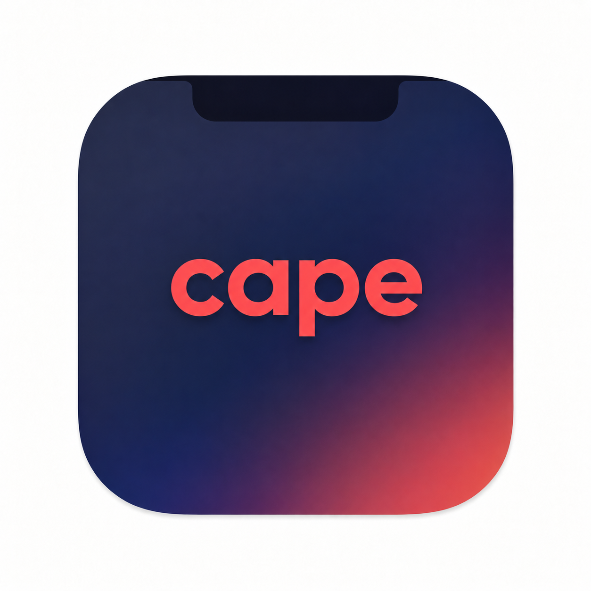
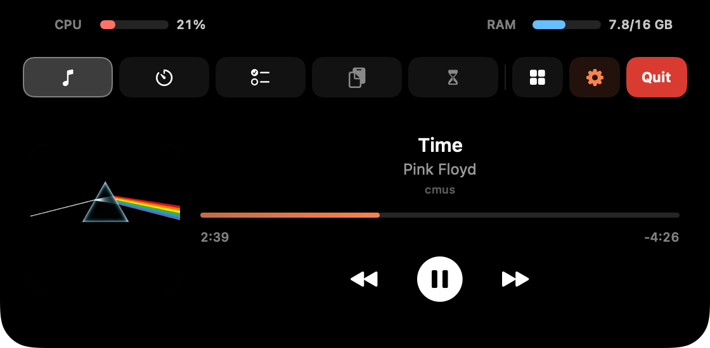
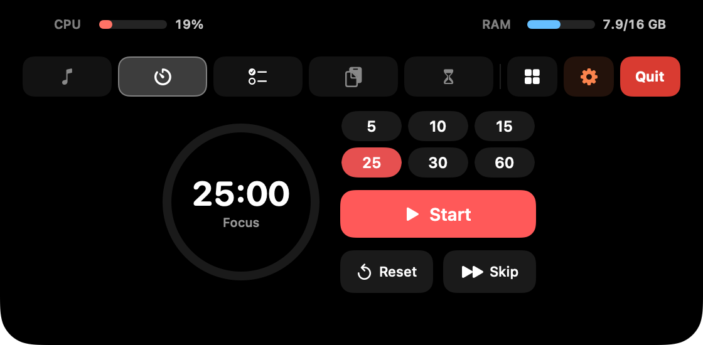
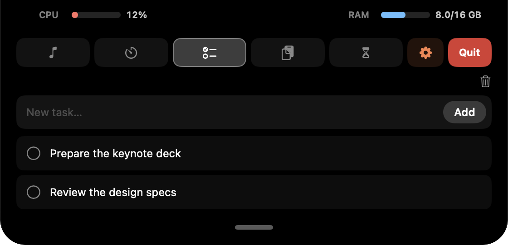
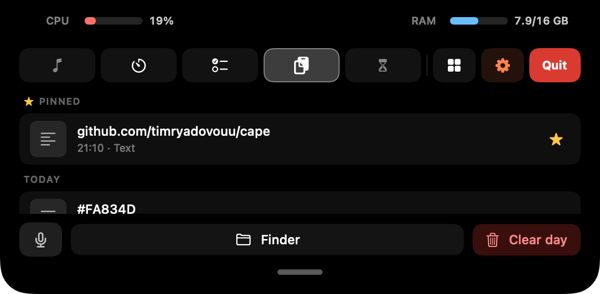
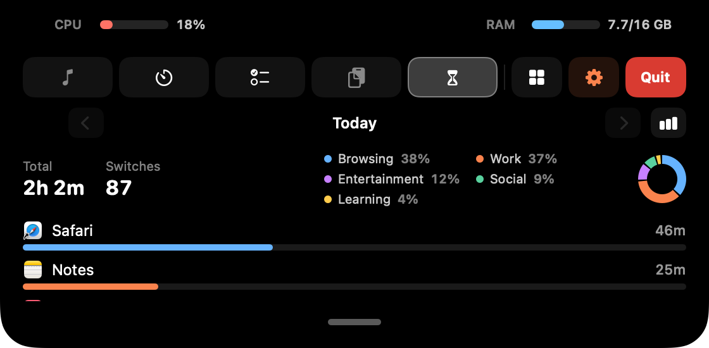

<p align="center">
  
</p>

<h1 align="center">mac-notch</h1>

<p align="center">
  A lightweight, Dynamic-Island-style hub that lives right in your MacBook notch.<br/>
  Hover the notch and it expands; move away and it collapses. No Dock icon, no menu-bar icon.
</p>

<p align="center">
  <a href="https://github.com/timryadovouu/mac-notch/actions/workflows/build.yml">
    
  </a>
  <a href="https://github.com/timryadovouu/mac-notch/releases">
    
  </a>
  
  
  
  
  
</p>

---

## Overview

**mac-notch** turns the empty space around the camera notch into a small control
center. Everything is a module you jump between from a horizontal icon rail; the
coral gear opens a proper Settings window. It's a single Swift Package
executable — SwiftUI + AppKit, with a single dependency
([WhisperKit](https://github.com/argmaxinc/WhisperKit)) powering on-device voice
dictation.

- Runs as an **accessory app** (`LSUIElement`) — invisible in the Dock and menu bar.
- Sits over the physical notch and morphs like the iPhone Dynamic Island.
- Works on notchless Macs and external displays too (a synthetic top-center notch).

## Screenshots

<p align="center">
  
  
</p>
<p align="center">
  
  
</p>
<p align="center">
  
</p>

## Modules

| Module | What it does |
| --- | --- |
| ⏱ **Timer** | Pomodoro with focus presets (5 / 10 / 15 / 25 / 30 / 60 min), a long break every 4 sessions. Configurable break lengths and a completion sound — pick any system sound (hover to preview) and choose whether it still plays during a Focus. A live countdown shows to the right of the notch; each phase change slides a **Focus / Break** alert in from the left. **Hover the collapsed countdown for inline pause / next / cancel** (or click the time to pause) — no need to open the panel. |
| 📋 **Buffer** | A persistent clipboard. Everything you copy is saved as a **real file** under the buffer folder, in a per-day `YYYY-MM-DD` subfolder — text, images, and any copied files. Click an entry to copy it back, or **drag it straight out** to Finder / any app. Per-row **star / copy / delete** on hover — **starred items pin to the top and survive** retention, "Clear day", and end-of-day wipes. "Finder" opens the folder, "Clear day" wipes today. Deletions made directly in the folder show up automatically. A **mic** button dictates speech straight into the buffer (see *Voice dictation*). |
| 🎵 **Media** | Now-playing + transport for **Spotify** (AppleScript) and **cmus** (`cmus-remote`). Play/pause reacts instantly. While something plays, a little **equalizer** pulses to the left of the notch; pause it and a coral ⏸ takes its place. |
| ✅ **Tasks** | A local to-do list: add, complete, delete, restore. **Undone tasks stay on top, completed ones sink to the bottom.** Copy a task's text, or move it to a trash that keeps deleted items for a while. |
| ⏳ **Screen Time** | Local, on-device usage tracking: it credits the frontmost app every second and shows ranked apps (with icons), total time and switch count — **how many apps to list is up to you** (top 5–20 or all). **Each day is kept as its own snapshot — browse past days with ◀ / ▶**, and toggle a bar chart of the current week (Mon–Sun). Resets at midnight; history retention is configurable. |

The **Tasks, Buffer and Screen Time** panels have a little home-indicator grabber
at the bottom — tap it to grow the panel vertically (and again to shrink).

## Beside the camera

When the panel is open, the black areas either side of the lens show live
**system metrics**: **CPU** on the left (coral bar + %), **RAM** on the right
(used / total GB). RAM "used" is resident active + wired memory, matching
`htop` / `btop` rather than Activity Monitor's higher, compression-inclusive
figure. No tab, no clutter — just there while you're already looking.

## The collapsed strip

Even when closed, the brow stays useful:

- **Left** — a pulsing **equalizer** while music plays (a coral ⏸ when paused), or a
  brief coral flash on copy and a **Focus / Break** alert on a timer phase change.
- **Right** — the Pomodoro **countdown** while a timer runs (hover it for inline
  **pause / next / cancel**, or click the time to pause), and a small pulsing
  **coral blob** whenever a Claude Code session is thinking (see below).

## Claude Code integration

Optional, off by default. Flip **Track Claude Code** in Settings and mac-notch
gives you two things:

- A pulsing **coral blob** on the right of the notch while any Claude Code
  session is actively working — it lights only between your prompt and Claude's
  stop, so it's a real "thinking now" indicator, not just "a session is open".
- Once you start using your 5-hour window, a coral line in the Timer tab shows
  when it resets — **"Claude limits reset at HH:MM"** (or **"Claude will be ready
  at HH:MM"** when it's actually maxed out) — and **"Claude is ready!"** once it
  frees up. The reset time is read back from disk, so it survives quitting Claude.
- Optionally, a **sound when Claude finishes thinking** — any system sound, with
  toggles to stay quiet during Focus/DND or while the Claude app is in front.

**How it works.** Enabling the toggle merges a few [hooks](https://docs.claude.com/en/docs/claude-code/hooks)
and a `statusLine` command into `~/.claude/settings.json` (backed up to
`settings.json.bak` first; your other settings are preserved):

- The **hooks** append session events to `~/.claude/mac-notch/events.jsonl`; that
  stream drives the blob.
- The **reset time** comes from whichever Claude you use:
  - **Terminal Claude Code** — mac-notch installs *itself* as your `statusLine`
    (a hidden `mac-notch statusline` subcommand), the only place the CLI exposes
    when a window resets. Your terminal footer becomes a compact
    `Opus 4.8 · project · main · ctx 42% · 5h 63% · wk 21%`.
  - **Desktop app** — the chat never runs a statusLine, so mac-notch reads the
    reset time straight from the desktop app's own local storage instead
    (best-effort: it's undocumented and may change between Claude versions).

Everything stays local — nothing is sent anywhere.

## Voice dictation

A **mic** button in the Buffer tab turns speech into text, fully **on-device** —
nothing leaves your Mac. Tap it (or use the global shortcut), speak, and the
transcript lands on the clipboard, ready in the buffer.

- **Local Whisper** via [WhisperKit](https://github.com/argmaxinc/WhisperKit),
  running on the Neural Engine. Pick the model in Settings (Tiny → Large v3 Turbo
  — bigger is more accurate and uses more RAM); it's **downloaded once** and
  warmed at launch so the first dictation is instant.
- **Language & translation** — choose the spoken language (auto-detect can
  misread some, e.g. Russian, so pick it explicitly) and optionally translate to
  English.
- **"note …" → Tasks** — a transcript starting with *note* / *заметка* is filed
  as a task instead of going to the clipboard.
- **Global shortcut** — double-tap **⌥ Option** to start/stop dictation from
  anywhere (needs Accessibility permission).
- The mic button reflects its state — recording (pulsing), loading the model,
  transcribing — and stays disabled until a model is downloaded.

## Settings

The coral **gear** toggles a standalone window:

- **General** — Launch at login and Track Claude Code.
- **Claude** — an optional sound when Claude finishes (its own system sound, plus Focus/DND and *mute while the Claude app is in front* toggles).
- **Modules** — enable/disable and reorder the tabs in the rail.
- **Timer** — short/long break lengths, the end-of-session sound (any system sound, hover to preview), and whether it plays during a Focus.
- **Voice** — dictation model (downloaded once, with a delete button and a ✓ on the ones you have), spoken language, translate-to-English, the double-⌥ shortcut, and preloading the model at launch.
- **Screen Time** — how long to keep daily history (default 1 year), and how many apps the list shows.
- **Buffer** — folder location, auto-clear age, or clear-at-end-of-day.
- **Notch** — reset-to-default-tab delay and which tab is the default.

## Install & run

Runs on macOS 13+. Two ways to get it:

### Option A — download the app (no tools needed)

> The prebuilt release is **Apple Silicon only**. On an Intel Mac, use Option B —
> building from source compiles it for your machine.

1. Open the [latest release](https://github.com/timryadovouu/mac-notch/releases/latest)
   and download **`mac-notch.zip`** under *Assets*.
2. Double-click the zip to unpack **`mac-notch.app`**, then drag it to
   **Applications** (optional, but tidy).
3. The build isn't signed/notarized, so the first launch is blocked by
   Gatekeeper. **Right-click the app → Open → Open** in the dialog (or, after a
   blocked double-click, go to **System Settings → Privacy & Security → Open
   Anyway**). You only do this once.

### Option B — build from source

Needs the **Xcode Command Line Tools** — install them once with
`xcode-select --install` (a few hundred MB; the full Xcode is not required).

```bash
git clone https://github.com/timryadovouu/mac-notch.git
cd mac-notch
./build-app.sh        # compiles, generates the icon, packages mac-notch.app
open mac-notch.app
```

`build-app.sh` drops **`mac-notch.app`** in the repo root. A build you compiled
yourself isn't quarantined, so there's no Gatekeeper prompt. For quick iteration
without packaging, `swift run` launches it straight from source.

### After it's running

There's **no Dock or menu-bar icon** — mac-notch lives over the notch. Hover the
notch to expand it. To start it automatically after a reboot, open Settings (the
coral gear) and turn on **Launch at login**. Quit from the red **Quit** button in
the expanded panel.

## Updating

There's no auto-update yet — grab a new version the same way you first installed
it: **quit** mac-notch (the red Quit button), download the latest
**`mac-notch.zip`**, and replace the app. Your **settings and data are kept** —
they live in `~/Library/Application Support/MacNotch/`, not inside the app, and a
downloaded dictation model stays too. The fresh download needs the one-time
Gatekeeper **right-click → Open** again.

## Where data lives

Everything stays on your Mac:

- Clipboard buffer: `~/Library/Application Support/MacNotch/localBuffer/`
- Tasks, Screen Time, settings: `~/Library/Application Support/MacNotch/`
- Dictation models (only if you use Voice): `~/Documents/huggingface/`
- Claude Code tracking (only if enabled): `~/.claude/mac-notch/`

When Claude tracking is on, mac-notch also **reads** (never writes) the reset
time from the desktop app's local storage; that data stays on your Mac too.

## Permissions

- **Media → Spotify** uses AppleScript, so macOS will ask for **Automation**
  access the first time — approve it or the track/controls won't work. **cmus**
  needs `cmus-remote` on your `PATH`.
- **Voice dictation** asks for **Microphone** access on first use; the optional
  double-⌥ shortcut also needs **Accessibility** (System Settings → Privacy &
  Security). Downloading a dictation model uses the network once.

## Project structure

```
Sources/MacNotch/
  main.swift / AppDelegate.swift      app entry (accessory policy, app icon, Edit menu)
  StatusLine.swift                    `mac-notch statusline` subcommand for Claude Code
  DesktopLimitReader.swift            reads the limit reset time from the Claude desktop app
  ScreenNotch.swift                   notch geometry (+ non-notch fallback)
  NotchController.swift               the window over the notch + hover logic
  NotchRootView.swift                 the brow, its morphing, equalizer & Claude blob
  ExpandedPanel.swift                 CPU/RAM header, icon rail + module hosting
  GrabberBar.swift                    shared grow/shrink pill
  *Panel.swift                        per-module UI
  PomodoroModel / BufferManager /
  MediaController / AppUsageTracker /
  TodoStore / SystemStats /
  ClaudeSessionsManager               module & integration logic
  VoiceDictation.swift                on-device dictation (WhisperKit) + mic capture
  DoubleOptionHotkey.swift            global double-⌥ dictation shortcut
  Settings.swift / SettingsPanel.swift  settings model + window
Resources/AppIcon.png                 app icon source
build-app.sh                          release build → mac-notch.app
.github/workflows/                     CI: build on push, publish on version tags
```

## License

[MIT](LICENSE) © Timofei Ryadovoi

## Notes

Inspired by [macnotch.io](https://macnotch.io).
