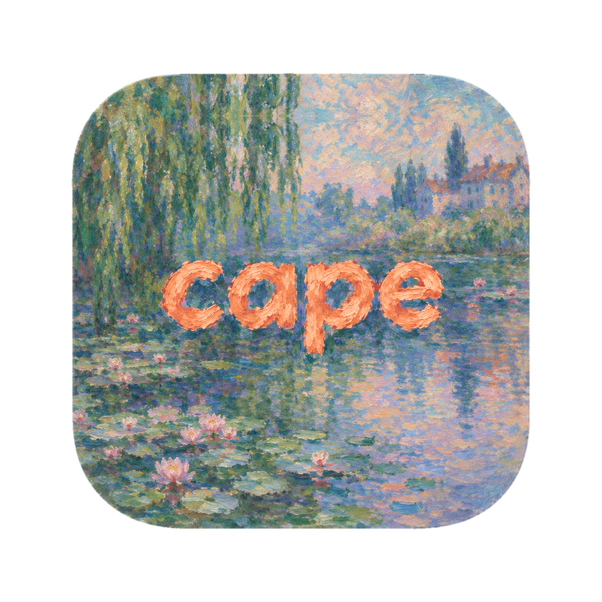
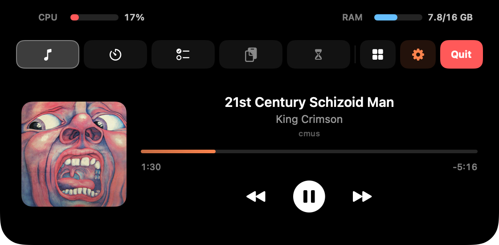
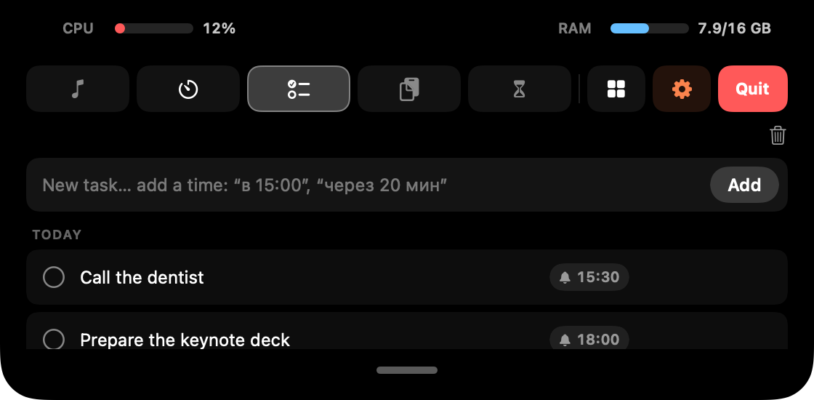
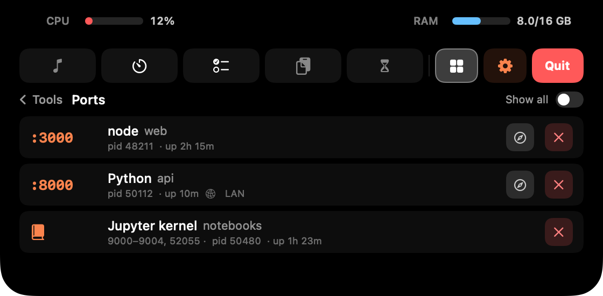
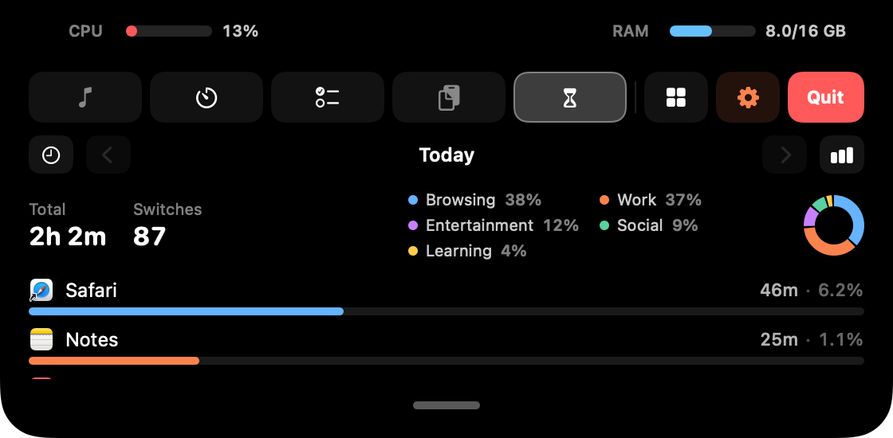

  

<h1 align="center">Cape</h1>

  Лёгкий хаб, который живёт прямо в «чёлке» MacBook. Dynamic Island у Apple —
  остров, а Cape — <strong>полуостров</strong>: он прикреплён к верхнему краю экрана
  и всегда под рукой. 
  Наведи курсор на чёлку — она раскроется, уведи — свернётся. Ни иконки в Dock, ни в строке меню.

  <a href="README.md">English</a> · <strong>Русский</strong>

  
  

  
  

> Это короткая версия на русском — самое главное. Все подробности (настройки,
> как устроена интеграция с Claude Code, где хранятся данные) — в
> [английском README](README.md).

## Главное

- 🎵 **Музыка** — Spotify и cmus: обложка альбома, коралловый ползунок (кликни
  или потяни, чтобы перемотать), клик по правому времени переключает «сколько
  осталось» ↔ «длина трека». **F7 / F8 / F9 работают и для cmus**, а трек
  появляется в Пункте управления. Клик по эквалайзеру слева от чёлки — пауза /
  play, а если задержать на нём курсор — откроется вкладка Музыка.
- 🎙 **Диктовка голосом** — полностью на устройстве (Whisper, ничего не уходит
  в интернет), текст сразу в буфер обмена. Запуск как удобно:
  - **двойное нажатие** ⌥ Option (любого), только правого ⌥ или ⌃ Control;
  - **рация** — держи 🌐 Fn или правый ⌥, отпусти — текст распознан;
  - начни фразу со слова **«заметка …»** — и она попадёт в задачи.

  Модель для распознавания скачивается один раз (*Settings › Voice*); пока её
  нет, клавиши диктовки не пишут — из чёлки выезжает плашка «Для диктовки нужна
  модель» с кнопкой ⬇, а потом показывает скачивание и подготовку (✕ — закрыть,
  если скачать потом).
- ✅ **Задачи с напоминаниями** — пиши время прямо в тексте: *«позвонить маме в
  15:00»*, *«через 20 минут»*, *«завтра в 9»* (24-часовой формат) или выбери
  дату и время кнопкой 🔔 — откроется карточка задачи с календарём. В нужный
  момент справа от чёлки выезжает звенящий колокольчик со звуком.
- 📋 **Буфер обмена** — всё, что копируешь, сохраняется настоящими файлами по
  дням; записи можно закреплять ⭐ и вытаскивать мышкой прямо в Finder.
  Скопировал картинку с QR-кодом (например, скриншот в буфер ⌃⇧⌘4) — ссылка из
  кода появится отдельной записью прямо под ней.
- 🧰 **Инструменты** (кнопка ▦ справа) — **пипетка** (HEX цвета с экрана — в
  буфер), **чистка клавиатуры** (все клавиши заблокированы, пока протираешь),
  **реверс колеса мыши** (трекпад остаётся «естественным») и **Ports** — какие
  dev-серверы слушают порты: открыть в браузере или остановить. Ядра Jupyter
  (открытые ноутбуки в VS Code) узнаёт и показывает одной строкой; если не нужен —
  скрой в *Settings › Tools*. Пипетке и чистке можно назначить свой шорткат.
- 🤖 **Сессии Claude Code** — справа от камеры коралловая «клякса», пока Claude
  работает, и янтарная, когда он ждёт тебя. Закончил, пока ты был в другом
  приложении, — в островке сидит **Clawd**, пиксельный зверёк Claude Code, и ждёт,
  пока посмотришь: клик по нему — сразу в эту сессию, или просто переключись в её
  приложение. Машет, топает, следит за курсором, потягивается в перерыв
  Pomodoro; заждался — засыпает (z z Z), а через час уходит домой за камеру. По
  одному на сессию, до четырёх рядом (всё настраивается). Наведи на островок — выпадет список
  сессий; клик открывает нужную сессию (в приложении Claude — прямо этот диалог).
  Завершённые уходят из списка, когда их откроешь, или сами через 15 минут. Повёл
  курсор с кляксы влево по чёлке — откроется обычный Cape. Островки слева и справа
  от камеры одной ширины, так что чёлка растёт симметрично.
  Когда Claude просит разрешение на команду — **«Да / Нет» прямо в чёлке**.
  Включается само, если на Mac есть Claude Code; выключить — на последнем шаге
  тура или в *Settings › General*, и тогда Cape ничего не читает.
- ✅ **`cape done`** — допиши `; cape done` к долгой команде в терминале
  (`npm run build; cape done`), и когда она закончится, чёлка мигнёт ✓ или ✗ со
  временем выполнения. Можно и без этого — для всех команд дольше N секунд.
  Если у тебя есть `~/.zshrc`, при первом запуске это включено сразу (выключить —
  в туре); иначе установка — *Settings › Terminal*.
- ⏱ **Помодоро** с таймером прямо на чёлке, ⏳ **Screen Time** — локальная
  статистика по приложениям с кольцевой диаграммой по категориям (работа,
  браузер, соцсети, развлечения…).
- 🔋 **Расход батареи по приложениям** — кнопка ⚡ в Screen Time: сколько процентов
  заряда съело каждое приложение за день («Safari · 46 мин · 6,2%»), итог, кольцо и
  график недели. **В сумме ровно столько, сколько потеряла батарея**: приложению
  достаётся его собственная работа плюс экран и остальной Mac, пока оно на
  переднем плане (как в iPhone); время, когда тебя нет, — в macOS. По умолчанию
  считается только работа от батареи. В macOS такого нет.
- ✨ **Мелочи на свёрнутой чёлке** — эквалайзер (или обложка), пока играет музыка; ⚡ с
  процентом заряда, когда подключаешь зарядку.
- 🔄 **Автообновление** — Cape сам проверяет новые версии и ставит их одной
  кнопкой.
- 🇷🇺 **Интерфейс на русском** — по умолчанию английский, русский включается в
  *Settings › General › Language* (Cape перезапустится).
- 👋 **Знакомство** при первом запуске — чёлка сама проводит по настоящим
  вкладкам и островкам; повторить можно в Настройках › Подсказки, там же собраны
  все хитрости. На последнем шаге можно выключить лишнее — Pomodoro, Экранное
  время или вещи для разработчиков (Claude Code, Ports, `cape done`); выключенное
  вообще не работает.
- 🎨 **Иконка на выбор** — «Моне» (по умолчанию), классическая, «Восход» или
  «Кувшинки» (*Settings › General › App icon*); меняется и в Finder, Launchpad и
  Spotlight.

## Установка

> Готовая сборка — только для Mac на **Apple Silicon** (M1 и новее), macOS 13+.

1. Скачай **`Cape.zip`** из [последнего релиза](https://github.com/timryadovouu/cape/releases/latest).
2. Распакуй и перетащи **`Cape.app`** в папку **«Программы»** — обновления
   ставятся только оттуда.
3. Первый запуск: **правый клик по приложению → «Открыть» → «Открыть»**. Это
   нужно один раз (почему — ниже, в «Безопасности»).
4. Чтобы Cape запускался сам: шестерёнка ⚙︎ → **Launch at login**.

Выход — красная кнопка **Quit** («Выйти») в раскрытой чёлке.

## Доступы

macOS попросит разрешения только для того, чем ты пользуешься:

- **Микрофон** — для диктовки.
- **Универсальный доступ (Accessibility)** — для клавиш диктовки (двойное
  нажатие и рация), чистки клавиатуры и реверса колеса мыши: Системные
  настройки → Конфиденциальность и безопасность → Универсальный доступ.
- **Автоматизация** — чтобы управлять Spotify.

Пипетке, Ports, QR-кодам, `cape done`, сессиям Claude и шорткатам инструментов
разрешения не нужны.

## Обновление

Начиная с 0.3.0 — **само**: когда выходит новая версия, на шестерёнке появляется
коралловая точка, а в **Settings › Updates** — кнопка **Install & Relaunch**.
Настройки, задачи и буфер при обновлении сохраняются, доступы не слетают.

Если у тебя версия 0.2.0 или старше (она ещё называлась *mac-notch*) — один раз
скачай `Cape.zip` вручную, дальше всё обновляется кнопкой.

## Безопасность и подпись

Cape подписан **личным сертификатом проекта** («Cape Signing»), а не платным
сертификатом Apple ($99 в год). Что это значит:

- **Apple не подтверждает, кто автор** — поэтому первый запуск через правый клик.
- **Подпись — это пломба.** Все файлы приложения «запечатаны» ключом автора:
  если после подписи в приложении что-то изменить, пломба ломается. Сертификат
  не добавляет код и не даёт приложению никаких прав — он только говорит, кто
  запечатал.
- **Обновления проверяются.** Cape ставит новую версию, только если она
  запечатана тем же ключом, — подмену он не установит.
- **Разрешения сохраняются.** macOS привязывает их к сертификату, а не к
  конкретной сборке, поэтому после обновления их не нужно выдавать заново.
- **Всё открыто.** Код в этом репозитории, релизы собирает GitHub Actions из
  исходников — логи сборки публичные.

## Где хранятся данные

Всё только на твоём Mac: буфер, задачи и настройки — в
`~/Library/Application Support/Cape/`. Если включить Claude Code, Cape добавит
свои хуки в `~/.claude/settings.json` (с резервной копией); `cape done` — одну
строку в `~/.zshrc` (тоже с копией). У нового Cape это включается само, только
если на Mac уже есть Claude Code и `~/.zshrc`, и выключается в туре или в
настройках. В интернет Cape ходит только чтобы
проверить обновления, скачать обложки Spotify и (один раз) модель для диктовки.

---

[MIT](LICENSE) © Timofei Ryadovoi · Полная документация — в [README на английском](README.md).
